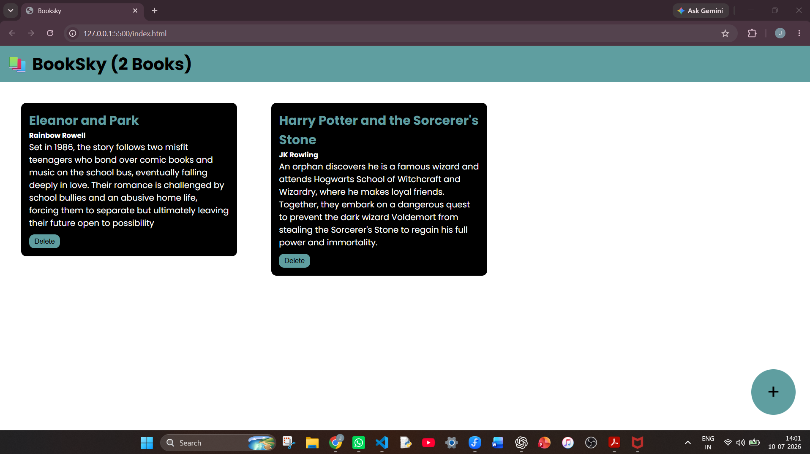
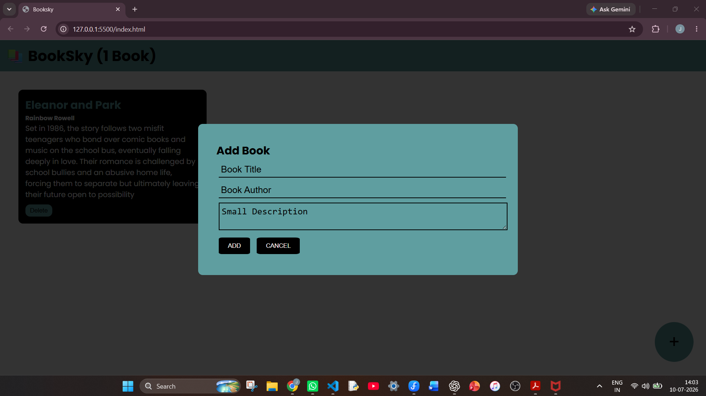

# 📚 BookSky

A simple and interactive Book Management web application built using **HTML, CSS, and JavaScript**.

## 📷 Screenshots

### Homepage



### Add Book Popup



🌐 **Live Demo:**  
https://jaisurya-git.github.io/Booksky/

---

## ✨ Features

- ➕ Add new books
- 🗑️ Delete books
- 📖 Dynamic book cards
- 📋 Form validation
- 🔄 Automatic form reset after adding a book
- 📊 Live book counter
- 🗑️ Delete confirmation dialog
- 🎉 Success notification after adding a book
- ⌨️ Close popup using the **Esc** key
- 🖱️ Close popup by clicking outside it
- 📚 Empty state when no books exist
- ✨ Hover animations for buttons and cards

---

## 🛠️ Technologies Used

- HTML5
- CSS3
- JavaScript (Vanilla JS)

---

## 📖 What I Learned

This project helped me understand:

- DOM Manipulation
- Event Listeners
- Dynamic HTML Elements
- Form Validation
- Template Literals
- JavaScript Timers (`setTimeout`)
- Keyboard Events
- CSS Positioning
- Git & GitHub
- GitHub Pages Deployment

---

## 🚀 How to Run

Clone the repository

```bash
git clone https://github.com/JaiSurya-git/Booksky.git
```

Open `index.html` in your browser.

---

## 👨‍💻 Author

**Jai Surya S**